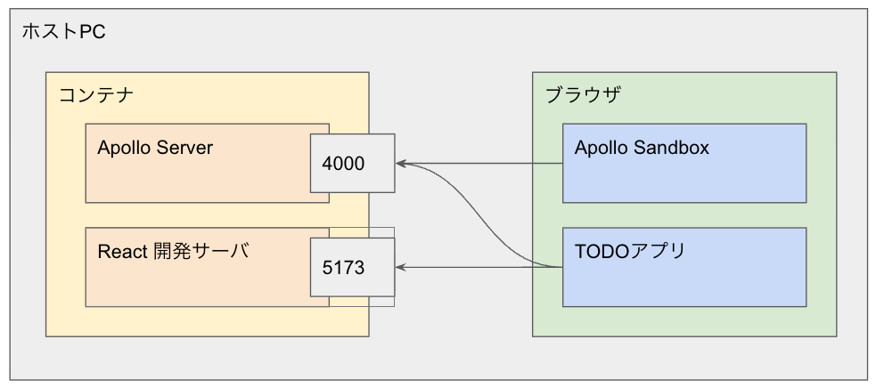

# これは何？

- GraphQLを検証する環境
  - Apollo Server
- ローカルを汚さないようにDockerで構築


# 構成

- コンテナは共通
- ApolloとReactの開発用サーバを別のポートに立てる




# 使い方

```
$ cd graphql_tutorial
$ docker compose up -d
```

Apollo Serverを立てる
```
$ docker compose exec backend bash
$ npm install
$ npm run start
```

http://localhost:4000 にアクセスする

Reactを動かす
```
$ docker compose exec frontend bash
$ npm install
# npm run dev
```

http://localhost:5173 にアクセスする

# 参考

- [【図解解説】これ1本でGraphQLをマスターできるチュートリアル【React/TypeScript/Prisma】](https://qiita.com/Sicut_study/items/13c9f51c1f9683225e2e)